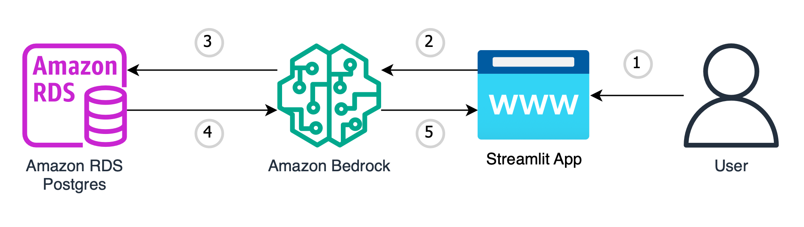

# Amazon-Bedrock-Amazon-RDS-POC

This is sample code demonstrating the use of Amazon Bedrock and Generative AI to use natural language questions to query relational data stores, specifically Amazon RDS. This example leverages the Open Source Database: https://www.kaggle.com/datasets/ashishsahani/hospital-admissions-data/data.

# **Goal of this Repo:**

The goal of this repo is to provide users the ability to use Amazon Bedrock and generative AI to take natural language questions, and transform them into relational database queries against Amazon RDS Databases. This repo is designed to work with
Amazon RDS Postgres, but can be configured to work with other database engine types.
This repo comes with a basic frontend to help users stand up a proof of concept in just a few minutes.

The architecture and flow of the sample application will be:



When a user interacts with the GenAI app, the flow is as follows:

1. The user makes a request, asking a natural language question based on the data in Amazon RDS to the GenAI app (app.py).
2. This natural language question is passed into Amazon Bedrock, which takes the natural language question and creates a SQL query (amazonRDS_bedrock_query.py).
3. The created SQL query is then executed against your Amazon RDS database to begin retrieving the data (amazonRDS_bedrock_query.py).
4. The data is retrieved from your Amazon RDS Database and is passed back into Amazon Bedrock, to generate a natural language answer based on the retrieved data (amazonRDS_bedrock_query.py).
5. The LLM returns a natural language response to the user through the streamlit frontend based on the retrieved data (app.py).

# How to use this Repo:

## Prerequisites:

1. Amazon Bedrock Access and CLI Credentials. Ensure that the proper FM model access is provided in the Amazon Bedrock console
2. Amazon RDS Access and the ability to create a database.
3. Please note that this project leverages the [langchain-experimental](https://pypi.org/project/langchain-experimental/) package which has known vulnerabilities.

code ref: https://github.com/aws-samples/genai-quickstart-pocs.git

## Step 1:

perform a git clone of the repository.
setup AWS CLI profile for your account

## Step 2:

Set up a python virtual environment through pipenv `pip install pipenv`

(
    for linux environment, install WSL in windows: 
    step1. https://learn.microsoft.com/en-us/windows/wsl/install
    step2. https://ubuntu.com/desktop/wsl
)

run `pipenv shell` to create virtual env

```
pip install -r requirements.txt
```

## Step 3:

Now that all the requirements have been successfully installed in your virtual environment we can begin configuring environment variables.
You will first need to create a .env file in the root of this repo. Within the .env file you just created you will need to configure the .env to contain:

```
profile_name=<aws_cli_profile_name>
region=<region_name>
rds_username=<rds_database_username>
rds_password=<rds_database_password>
rds_endpoint=<rds_database_endpoint>
rds_port=<rds_port>
rds_db_name=<rds_database_name>
```

Please ensure that your AWS CLI Profile has access to Amazon Bedrock!

Depending on the region and model that you are planning to use Amazon Bedrock in, you may need to reconfigure lines 19-25 in the amazonRDS_bedrock_query.py file:

```
llm = Bedrock(
    credentials_profile_name=os.getenv("profile_name"),
    model_id="amazon.titan-text-express-v1",
    endpoint_url="https://bedrock-runtime.us-east-1.amazonaws.com",
    region_name="us-east-1",
    verbose=True
)
```

# Step 4

Load the sample data to your Amazon RDS Postgres Database.

review the prompts.yaml file in the SampleData directory to see how prompts are constructed for the application and modify according to your requirements.

# Step 5

At this point the application should be ready to go. To start up the application with its basic frontend you simply need to run the following command in your terminal while in the root of the repositories' directory:

```
streamlit run app.py
```

As soon as the application is up and running in your browser of choice you can begin asking natural language questions against your Amazon RDS Database.
